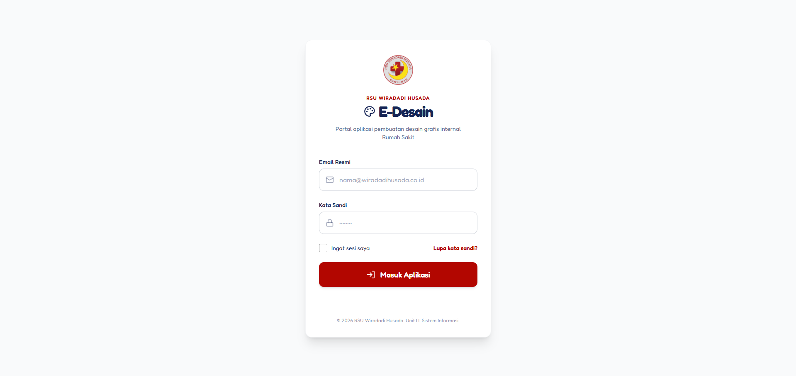
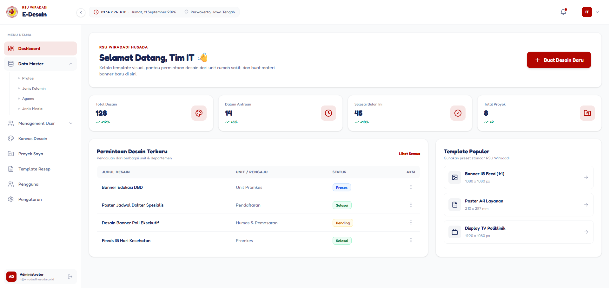

# 🏥 E-Desain RSU Wiradadi Husada

[](https://laravel.com)
[](https://php.net)
[](https://www.rsuwiradadihusada.co.id)

**E-Desain** adalah platform internal berbasis web yang dirancang khusus untuk pegawai **RSU Wiradadi Husada**. Aplikasi ini berfungsi untuk mempermudah, mempercepat, dan mendokumentasikan proses **pengajuan pembuatan serta pencetakan desain media promosi** rumah sakit secara digital dan terintegrasi.

---

## 📷 Screenshots / Alur Aplikasi

| 1. Halaman Login | 2. Dashboard Utama |
|---|---|
|  |  |
| *Pintu masuk pegawai RSU Wiradadi Husada ke dalam sistem.* | *Pusat kendali dan ringkasan pengajuan desain.* |

---


## ✨ Fitur Utama

- 📝 **Pengajuan Desain Digital:** Pegawai dapat mengisi formulir kebutuhan media promosi (ukuran, jenis media, teks/konten, dan referensi gambar).
- 🔄 **Tracking Status Real-Time:** Memantau status pengajuan mulai dari _Pending_, _In Progress (Didesain)_, _Review_, hingga _Selesai/Dicetak_.
- 🖨️ **Manajemen Pencetakan:** Fitur khusus untuk tim Humas/Promkes/Desain untuk mengelola antrean cetak media promosi yang disetujui.
- 📂 **Arsip Media Promosi:** Menyimpan riwayat file desain yang pernah dibuat agar bisa digunakan kembali di kemudian hari.
- 🔔 **Notifikasi Internal:** Pemberitahuan otomatis ketika desain telah selesai dikerjakan atau membutuhkan revisi.

---

## 🛠️ Teknologi & Spesifikasi

- **Framework:** Laravel 12.x
- **Database:** MySQL
- **Frontend UI:** Tailwind CSS / Bootstrap (Sesuaikan dengan yang Anda pakai)
- **Kebutuhan Server:** PHP >= 8.2, Composer

---

## 🚀 Panduan Instalasi Lokal

Ikuti langkah berikut untuk menjalankan aplikasi di lingkungan _development_:

### 1. Clone & Masuk Folder

```bash
git clone https://github.com
cd e-desain-rsuwh
```

### 2. Install Dependencies

```bash
composer install
npm install && npm run dev
```

### 3. Setup Environment

Salin file `.env.example` menjadi `.env`:

```bash
cp .env.example .env
```

Buka file `.env`, lalu sesuaikan konfigurasi database Anda:

```env
DB_CONNECTION=mysql
DB_HOST=127.0.0.1
DB_PORT=3306
DB_DATABASE=namadatabase
DB_USERNAME=user
DB_PASSWORD=password
```

### 4. Generate Key & Migrasi Database

```bash
php artisan key:generate
php artisan migrate --seed
```

_(Catatan: `--seed` akan mengisi data master awal seperti akun admin/tim desain jika sudah Anda buat di Seeder)._

### 5. Jalankan Aplikasi

```bash
php artisan serve
```

Akses aplikasi melalui browser di: `http://127.0.0.1:8000`

---

## 👥 Tim Pengembang / Kontak

- **Indra Kusuma** - _Full Stack Developer_ - [GitHub](https://github.com)
- **Bagian Teknologi Informasi RSU Wiradadi Husada**
